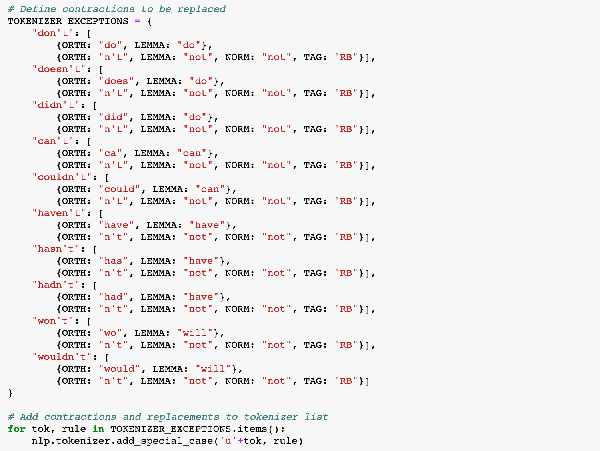
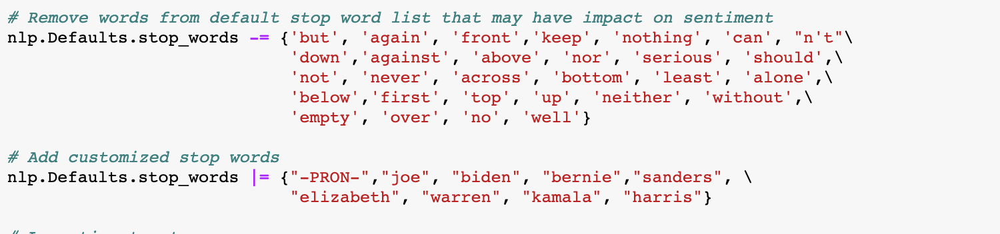
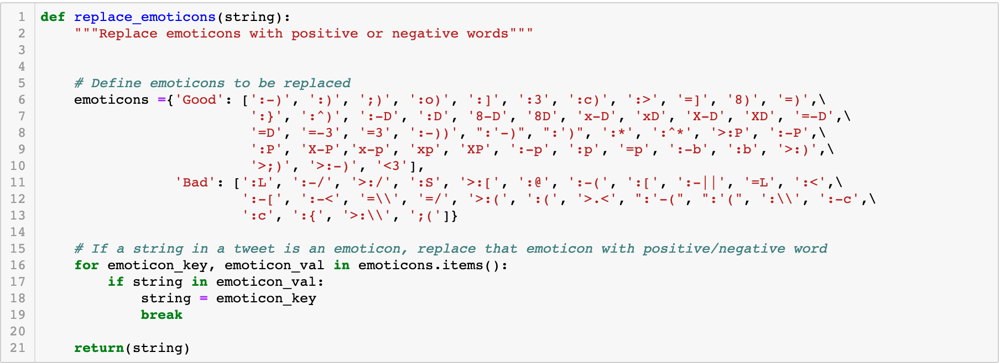
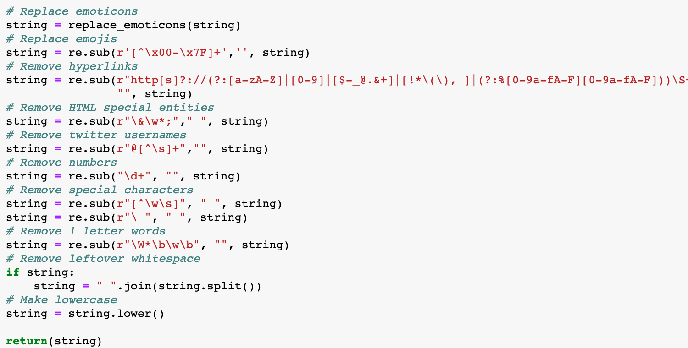
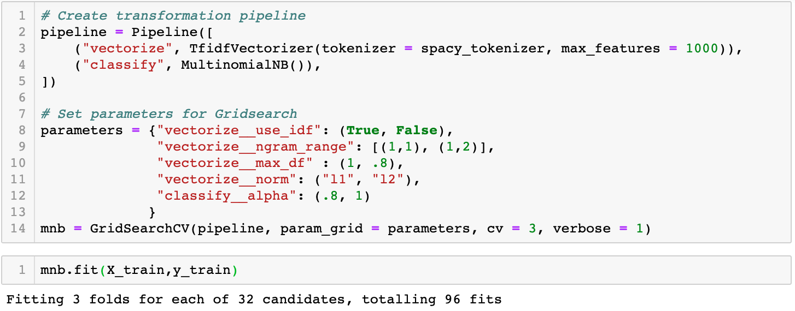
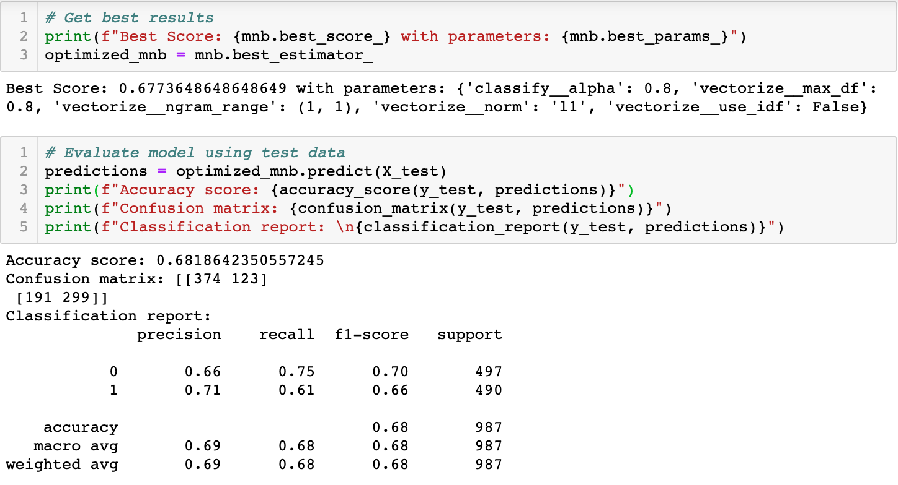

# Sentimental Politics

Sentiment Analysis of the top 2020 Presidential Candidates.

## Table of contents

* [General info](#general-info)
* [Technologies](#technologies)
* [Development Process](#development-process)
* [Setup](#setup)
* [Features](#features)
* [Status](#status)
* [Inspiration](#inspiration)
* [Resources](#resources)
* [Contact](#contact)

## General info

The purpose of this project is to explore sentiment analysis using natural language processing in machine learning. To do this, we created multiple machine learning models with different classifiers using a previously analyzed twitter dataset from [Sentiment140](http://help.sentiment140.com/for-students). We then gathered all tweets mentioning the top four Democratic candidates in the Presidential 2020 over a time span of a week, applied the most optimized machine learning model to them, and created visualizations of our results.

## Technologies

### Languages Used

* Python
* Javascript
* CSS
* HTML
* SQL

### Data Extraction and Munging

* Jupyter notebook - version 4.1
* Pandas - version 0.23.4
* Numpy - version 1.15.4
* Spacy - version 2.1.7
* Tweepy - version 3.8.0

### Machine Learning

* scikit-learn - version 0.21.3
* NLTK - version 3.4
* Tech 3 - version 3.0

### Database

* sqlite3 - version 3.26.0
* SQLAlchemy - version 1.2.15

### Data Rendering and Visualization

* Flask - version 1.0.2
* Jinja2 - version 2.10
* Javascript Packages:
  * d3 - version 5
  * JQuery - version 3.4.1
  * Plotly - version 1.49.1
  * JQCloud - version 2.0.3
* HTML & CSS:
  * Modernizr - version 2.6.0
  * Foundation - version 4

## Development Process

### Data Extraction

Created python script to query Twitter API using Tweepy library. Tweepy facilitates easy querying capability using cursoring to cycle through multiple pages of results. The script creates and appends query results to a csv file for each chosen candidate. As we were utilizing the free version of the twitter API, our querying capabilities were limited to the past week and required waiting periods for access to be refreshed. For this reason, we ran this script multiple times over the course of a week to gather all tweets necessary for us to do our analysis.

### Data Munging

Developed python cleaning script in jupyter notebook that prepares tweets for use in natural language processing.

We decided to use the python spaCy library to tokenize the tweets, as it has a more advanced library and lemmatization features than the older NLTK. For this project, we only used the simple features of spaCy, but in future development, we will investigate using the more advanced parts of speech and dependency tagging for more advanced modeling.

We decided to replace negative contractions with their full words and removed some words from spaCy's default stop word library, as we felt these words could be influential in the analysis.

After that, we tokenized the tweet and replaced each token with its corresponding lemma. We decided to using lemmatization instead of stemming, as it tends to be more precise, and we wanted the option to create word clouds in our visualization step.

Once the tweet was tokenized, we ran each token through a clean function. First, we replaced positive emoticons with the word "good" and negative emoticons with the word "bad," as these emoticons could be a valuable determinant of sentiment.

We then replaced all other junk from each token and returned a string in all lowercase.

After the token was cleaned, we verified the returned string was not a stop word nor an empty string and appended it back into the cleaned tweet string.

### Machine Learning

Created and tested various classification models to analyze tweet sentiment in python using scikit-learn.

We used a previously analyzed twitter dataset from [Sentiment140](http://help.sentiment140.com/for-students) to test and train our models. For speed purposes, we used a random sampling of 25% of the over 1.5 million row dataset. We first attempted to use a larger slice of the dataset, but the time and size cost was unwieldy. We found that using a smaller dataset did not significantly impact the accuracy of the models.

Once we chose our slice, we did a basic cleaning of the dataset by checking for missing values, verifying data were of the correct type, and dropping unnecessary columns. We then applied the previously defined cleaning function to the tweets.

We then split our data into training and testing sets using the default 75%:25% split. To optimize each of our models and prevent overfitting, we created transformation pipelines and set of parameters to test using the GridSearchCV module.

First, we tested the Multinomial Naive Bayes Classifier. This classifier is based on assumption that the probability of each event is independent of all other events, as applied to datasets with multiple variables. ### GRETEL - VERIFY THIS DEFINITION### This is a popular model used in sentiment analysis and tends to produce relatively accurate models, even though it is counterintuitive to think of words being completely independent of each other.

GRETEL - ### UPDATE SCREENSHOTS###

We used the TfidVectorizer to vectorize ##GRETEL - IT DOES MORE THAN JUST VECTORIZE### the features, testing it with various parameters. #GRETEL - GO INTO TESTING THE VARIOUS PARAMETERS HERE. Then we added the Multinomial Naive Bayes Classifier to the pipeline with different alphas. #GRETEL - CONSIDER ADDING MORE PARAMETERS TO TEST.

After fitting, we obtained the parameters that led to the best model and printed accuracy metrics.

## Setup

Describe how to install / setup your local environement / add link to demo version.
Remember to download NLTK and spacy dictionaries

## Features

List of features ready and TODOs for future development

* Awesome feature 1
* Awesome feature 2
* Awesome feature 3

To-do list:

* Wow improvement to be done 1
* Wow improvement to be done 2

## Inspiration

Add here credits. Project inspired by..., based on...

## Resources

* [Sentiment140 Twitter Corpus](http://help.sentiment140.com/for-students) - Previously analyzed twitter corpus that we used to train and test machine learning models for twitter sentiment analysis.
  * [Methodology](https://cs.stanford.edu/people/alecmgo/papers/TwitterDistantSupervision09.pdf)
  * Citation: Go, A., Bhayani, R. and Huang, L., 2009. Twitter sentiment classification using distant supervision. CS224N Project Report, Stanford, 1(2009), p.12.

* [Epic Template](https://www.templatemonster.com/blog/free-zurb-foundation-templates/)

## Contact

Created by [Gretel Uptegrove](https://gretelup.github.io/) &
[Smita Sharma](https://)
