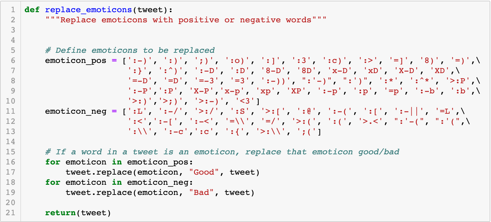
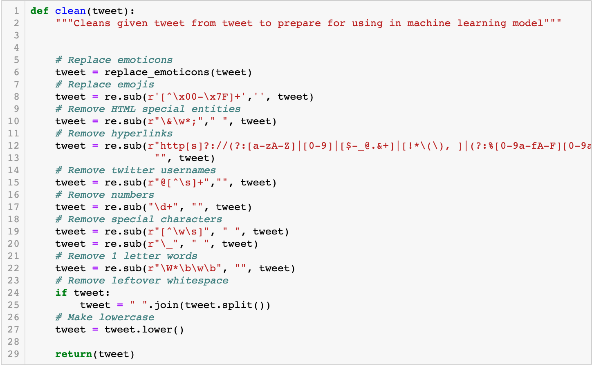

# Sentimental Politics

Sentiment Analysis of the top 2020 Presidential Candidates.

## Table of contents

* [General info](#general-info)
* [Technologies](#technologies)
* [Development Process](#development-process)
* [Contact](#contact)

## General info

The purpose of this project is to explore sentiment analysis using natural language processing in machine learning. To do this, we created multiple machine learning models with different classifiers using a previously analyzed twitter dataset from [Sentiment140](http://help.sentiment140.com/for-students). We then gathered all tweets mentioning the top four Democratic candidates in the Presidential 2020 over a time span of a week, applied the most optimized machine learning model to them, and created visualizations of our results.

## Technologies

### Languages Used

* Python
* Javascript
* CSS
* HTML
* SQL

### Data Extraction and Munging

* Jupyter notebook - version 4.1
* Pandas - version 0.23.4
* Numpy - version 1.15.4
* Spacy - version 2.1.7
* Tweepy - version 3.8.0

### Machine Learning

* scikit-learn - version 0.21.3
* NLTK - version 3.4
* Tech 3 - version 3.0

### Database

* sqlite3 - version 3.26.0
* SQLAlchemy - version 1.2.15

### Data Rendering and Visualization

* Flask - version 1.0.2
* Jinja2 - version 2.10
* Javascript Packages:
  * d3 - version 5
  * JQuery - version 3.4.1
  * Plotly - version 1.49.1
  * JQCloud - version 2.0.3
* HTML & CSS:
  * Modernizr - version 2.6.0
  * Foundation - version 4

## Development Process

### Data Extraction

Created python script to query Twitter API using Tweepy library. Tweepy facilitates easy querying capability using cursoring to cycle through multiple pages of results. The script creates and appends query results to a csv file for each chosen candidate. As we were utilizing the free version of the twitter API, our querying capabilities were limited to the past week and required waiting periods for access to be refreshed. For this reason, we ran this script multiple times over the course of a week to gather all tweets necessary for us to do our analysis.

### Data Munging

Developed python cleaning script in jupyter notebook that prepares tweets for use in natural language processing.

First, we replaced positive emoticons with the word "good" and negative emoticons with the word "bad," as these emoticons could be a valuable determinant of sentiment.

We then replaced all other junk from each token, removed extra spaces, and returned a string in all lowercase.

### Machine Learning

Created and tested various classification models to analyze tweet sentiment in python using scikit-learn.

We used a previously analyzed twitter dataset from [Sentiment140](http://help.sentiment140.com/for-students) to test and train our models. As that dataset contains over 1.5 million rows, we used a random sampling of approximately 3700 tweets (.0025% of the dataset). We had previously attempted to use a larger slice of the dataset, but the time and size cost was unwieldy.

Once we chose our slice, we did a basic cleaning of the dataset by checking for missing values, verifying data were of the correct type, and dropping unnecessary columns. We then applied the previously defined cleaning function to the tweets.

Then we defined our tokenizer function. We decided to use the spaCy library as it has shown potential to create better NLP models than the older libraries. We utilized it's lemmatizing functionality to best tokenize our tweets as lemmatizing tends to create better models, and we wanted the option to create word clouds in our visualization step. We also added customized stop words to spaCy's default list. These include frequently occuring tokens that would not affect sentiment, pronouns, and candidate names, as they would be frequently occuring in both positive and negative tweets.

We then split our data into training and testing sets using the default 75%:25% split. To optimize each of our models and prevent overfitting, we created transformation pipelines and set of parameters to test using the GridSearchCV module.

First, we tested the Multinomial Naive Bayes Classifier. This classifier is based on assumption that the probability of each event is independent of all other events. This is a popular model used in sentiment analysis and tends to produce relatively accurate models, even though it is counterintuitive to think of words being completely independent of each other.

We used the TfidVectorizer transform and vectorize the features, using our previously defined tokenizer function. By utilizing a gridsearch, we were able to test multiple parameters. Then we added the Multinomial Naive Bayes Classifier to the pipeline with different alphas.

After fitting, we obtained the parameters that led to the best model and printed accuracy metrics.

Then, we created a new pipleine with the same set of parameters to test using TfidVectorizer, but with the Complement Naive Bayes Classifier instead. This classifier uses statistics from the complement of each class to compute the model's weights and tends to outperform the Multinomial Naive Bayes Classifier in natural language processing.

After fitting, we obtained the parameters that led to the best model and printed accuracy metrics.

As shown, the Complement Naive Bayes Model outperformed the Multinomial Naive Bayes Model, so we saved that model to apply to the candidates' tweets.

## Resources

* [Sentiment140 Twitter Corpus](http://help.sentiment140.com/for-students) - Previously analyzed twitter corpus that we used to train and test machine learning models for twitter sentiment analysis.
  * [Methodology](https://cs.stanford.edu/people/alecmgo/papers/TwitterDistantSupervision09.pdf)
  * Citation: Go, A., Bhayani, R. and Huang, L., 2009. Twitter sentiment classification using distant supervision. CS224N Project Report, Stanford, 1(2009), p.12.

* [Epic Template](https://www.templatemonster.com/blog/free-zurb-foundation-templates/)

## Contact

Created by [Gretel Uptegrove](https://gretelup.github.io/) &
Smita Sharma
